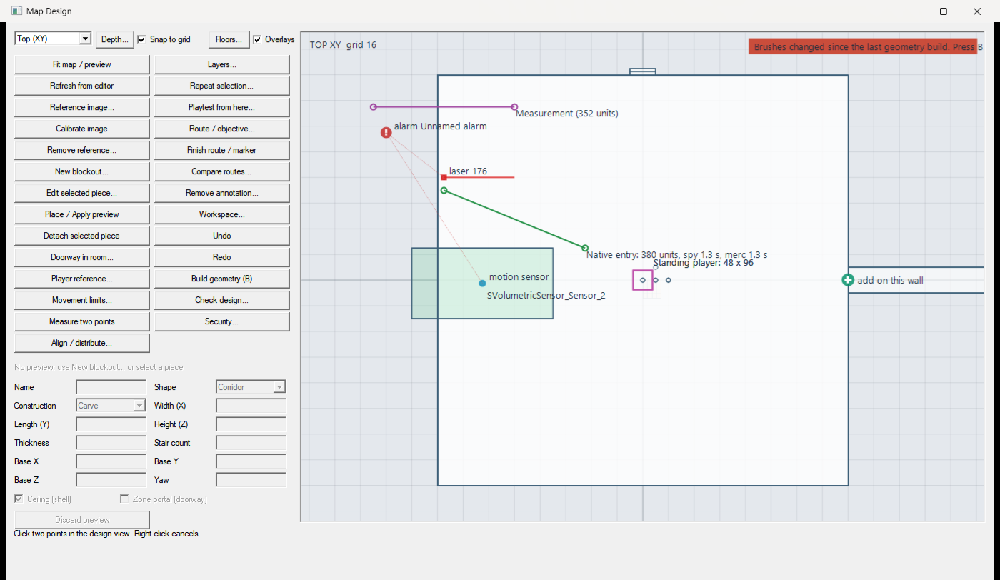
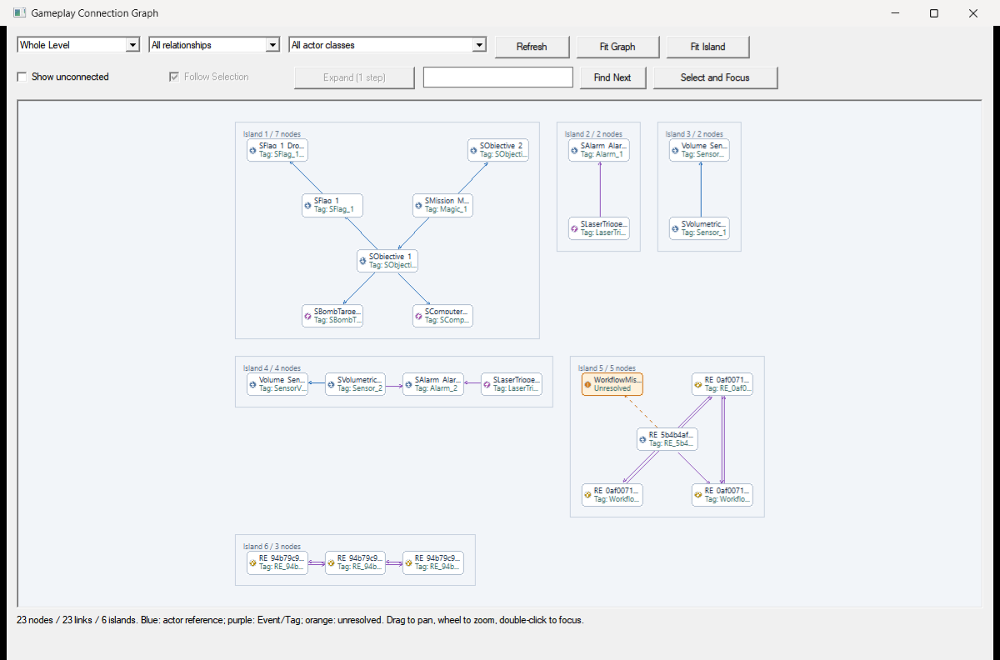
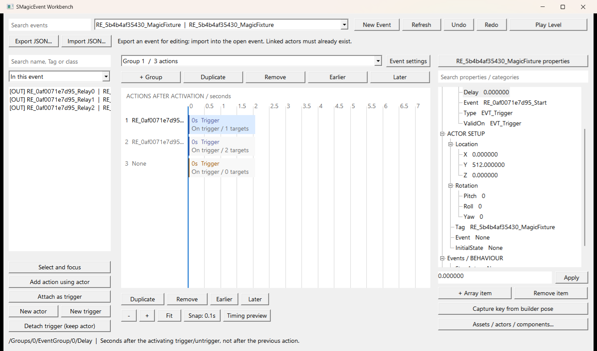
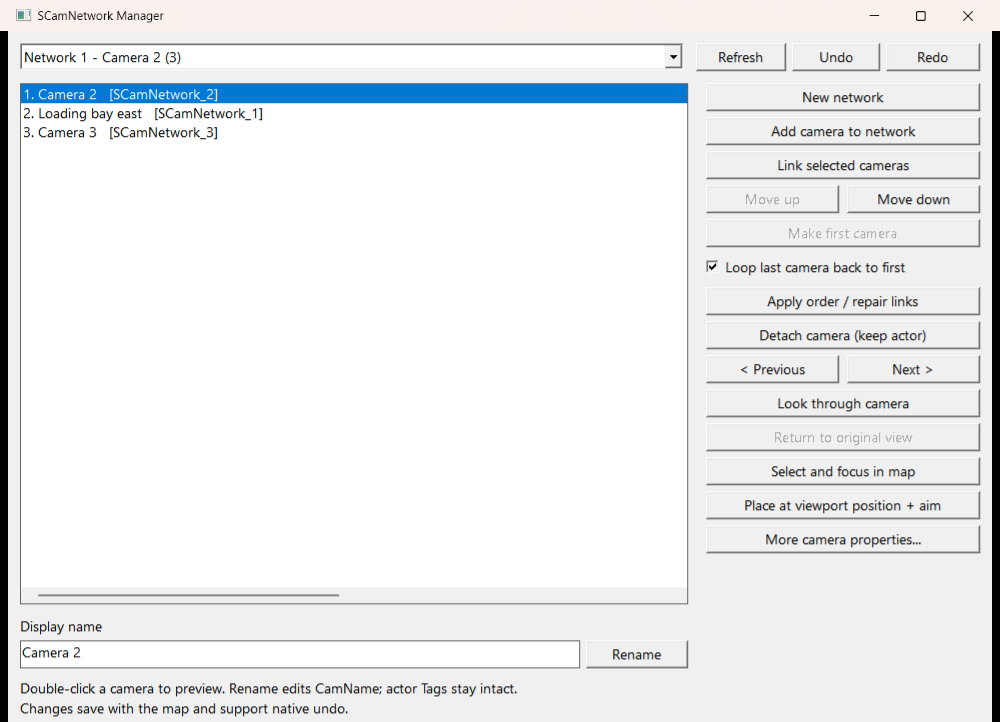
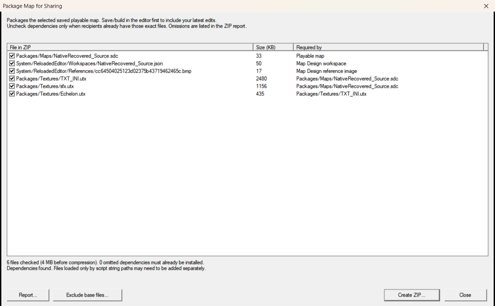

# SCCT Versus Reloaded Editor

An unofficial patch for the **Splinter Cell: Chaos Theory Versus** map editor. It works with the stock game and with [Enhanced SCCT Versus](https://github.com/Joshhhuaaa/EnhancedSCCTVersus), and builds on [AllyPal's Reloaded Editor](https://github.com/AllyPal/SCCT_Versus_Reloaded_Editor).

## Install

1. Download the ZIP from [Releases](https://github.com/Lumbridge/SCCT_Versus_Reloaded_Editor/releases).
2. Extract it into the folder that contains `SCCT_Versus.exe`.
3. Run `Reloaded_Editor.exe`.

Looking for maps to open? Recovered, enhanced and community maps are in [SCCT-Maps](https://github.com/Lumbridge/SCCT-Maps), and [SCCT Map Manager](https://github.com/Lumbridge/SCCT-Map-Manager) installs them for you.

## What it adds

### Map Design workspace



**View > Reloaded Tools > Map Design...** is a floor-plan view for planning and greyboxing a map. Draw rooms, corridors, vents and doorways as parametric pieces and drag, resize or type to change them; the brushes in the map follow every edit in one Undo step. Right-click anywhere for what applies at that point. Copy, paste, duplicate and mirror pieces, pick common sizes from presets, draw sightlines that show where a wall blocks the view, or start from a **Versus starter layout** with spawn rooms, corridors, a vent route, starts, a mission and an objective already placed. It also has reference images, player-size guides, routes timed for spies and mercs, playtest spawns, groups and locks in a Scene panel, a design check, a **Security** window that places lasers, cameras, motion sensors, mines and alarms and wires them together, and lights placed from presets, dragged into reach, and checked for the dark spots spies will use. Full guide: [docs/MapDesign.md](docs/MapDesign.md).

### Gameplay tools



| Tool | What it does |
| --- | --- |
| **Gameplay Connections** | See every Tag/Event link in the map as a list or a graph, jump to connected actors, rename Tags together with the events that use them. |
| **SMagicEvent Workbench** | Edit event groups, triggers, actions and timing in one panel, with JSON export/import for sharing an event. See [the JSON format](tests/SMagicEventJson.md). |
| **SCamNetwork Manager** | Create, name, preview and reorder security cameras; links and first-camera flags are kept consistent. |
| **Objective creation** | Right-click an SMission or SObjective to add objectives, computer triggers, bomb targets or flag/drop-zone pairs, already linked. |
| **Map JSON import/export** | Export a map to JSON, edit it (or have something edit it for you), and import the changes in one Undo step. See [docs/MapAuthoring.md](docs/MapAuthoring.md). |

### Map recovery, lighting and sharing

| Tool | What it does |
| --- | --- |
| **Recover Compiled Map** (File menu) | Turns a compiled `.sdc` into an editable map with brushes, actors and extracted meshes. Takes a few minutes; the original file is untouched. |
| **Recalculate Selected Lighting** (Build menu) | Re-bakes lighting only for the selected faces, brushes and meshes, keeping the recovered lighting everywhere else. |
| **Match Selected BSP Lighting** (Build menu) | Experimental: blends new BSP faces into the surrounding original lighting. |
| **Package Map for Sharing** (File menu) | Builds a ZIP of the map with all its dependencies and an install readme. |

Recovered maps keep their original baked lighting through ordinary builds. Recovery is experimental: brush history cannot be restored and geometry may come back fragmented, so check the result in the editor and in game.

### Everyday editing

| Tool | What it does |
| --- | --- |
| **Open Recent** | **File > Open Recent** lists the last ten maps opened or saved, and warns before discarding unsaved changes. (The editor's own autosave, in Advanced Options, still writes `Auto0` to `Auto9.sdc` into MapsEd every five minutes.) |
| **Play From Camera** | **Build > Play From Camera as Spy / Merc** starts a playtest at the perspective viewport's camera, from that team's start or a temporary one that is removed afterwards. |
| **Select and hide** | Right-click an actor for **Reloaded: Select** (all of this class, all with this Tag, same static mesh, invert the selection) and **Reloaded: Visibility** (hide selected, isolate selected, unhide all); Brush Visibility has the same three buttons. |
| **Brush Visibility** | Show, hide, isolate or select zones, portals, volumes, brushes and movers from one panel. |
| **Working Views** | Save and restore viewport cameras and display settings. |
| **Actor Assemblies** | Save groups of actors and brushes and reuse them across maps. |
| **Find Usages** | Find where a texture or mesh is used, and replace it. |
| **Favorites** | Keep frequently used materials and meshes together. |
| **BSP texture copy/paste** | Copy a surface's material without disturbing the target's alignment. |
| **Select Brush** | Select the source brush from a BSP surface. |
| **Grid snapping** | Right-click a brush face or vertices to snap them to the grid per axis; **Ctrl + mouse wheel** changes the grid size. |
| **Fit builder brush to meshes** | Right-click selected meshes to wrap the builder brush around them. |
| **Reloaded Shortcuts** | **Help > Reloaded Shortcuts...** lists every key, mouse gesture and menu the patch adds, with the Geometric Event keys as configured. |
| **Fixes** | Playtests launch at the monitor's resolution, off-screen property windows come back, a missing builder brush is repaired, larger BSP point counts are supported, and crashes are logged. |

AllyPal's original fixes are included: faster selection, restored Echelon lighting, improved lightmaps and larger WAV imports.

<details>
<summary>More screenshots</summary>







</details>

<details>
<summary>Build from source</summary>

Use a Visual Studio C++ developer PowerShell with the v143 toolset and the manifest's vcpkg dependencies installed:

```powershell
$env:SCCT = $null # Skip deployment into an installed game.
msbuild SCCT_Versus_Reloaded_Editor.sln /m /t:Rebuild /p:Configuration=Release /p:Platform=x86 /p:PlatformToolset=v143
if ($LASTEXITCODE -ne 0) { throw 'Release build failed' }
./tools/package_release.ps1
```

The release ZIP is written to `bin/Reloaded_Editor.zip`. Packaging downloads the unchanged AllyPal v1.2 launcher and verifies its hash; pass `-LauncherPath` to use a local copy. Tests are described in [tests/README.md](tests/README.md).

</details>
