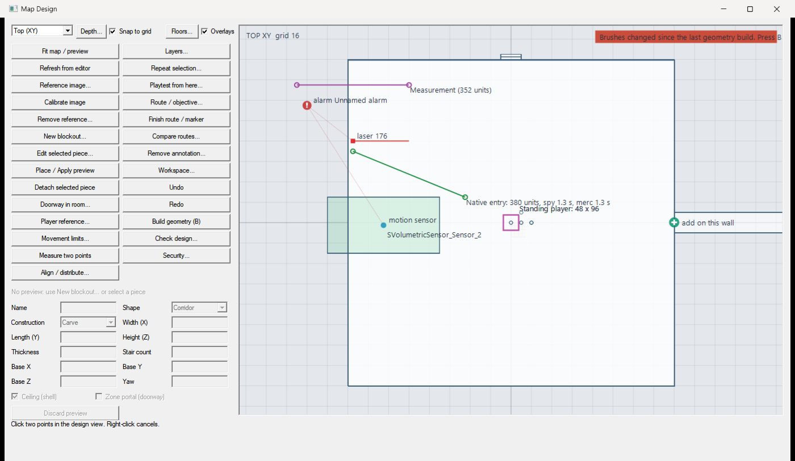
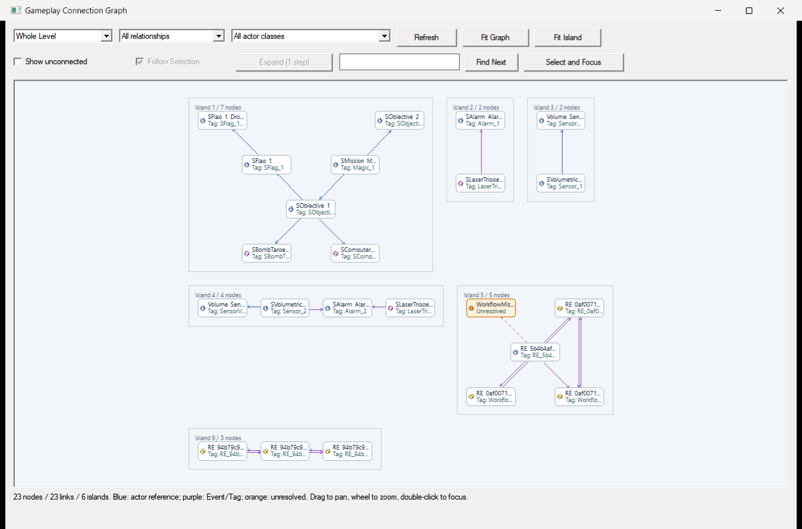
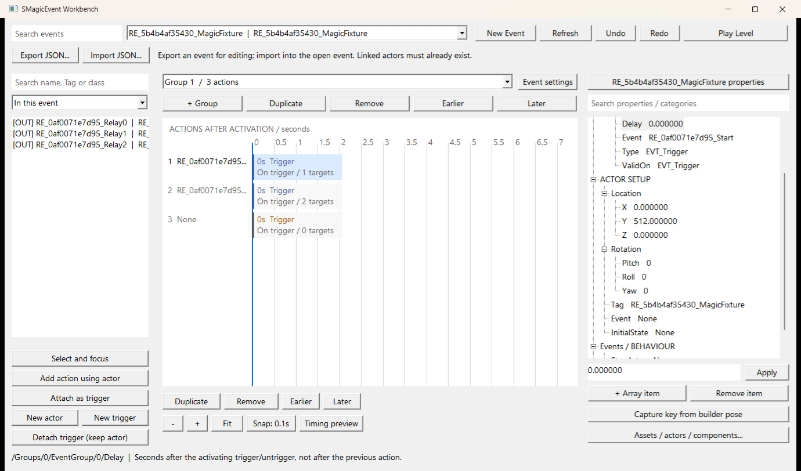
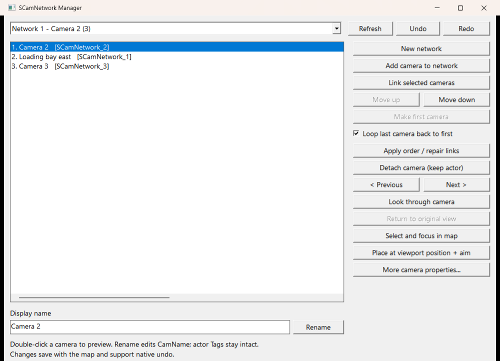
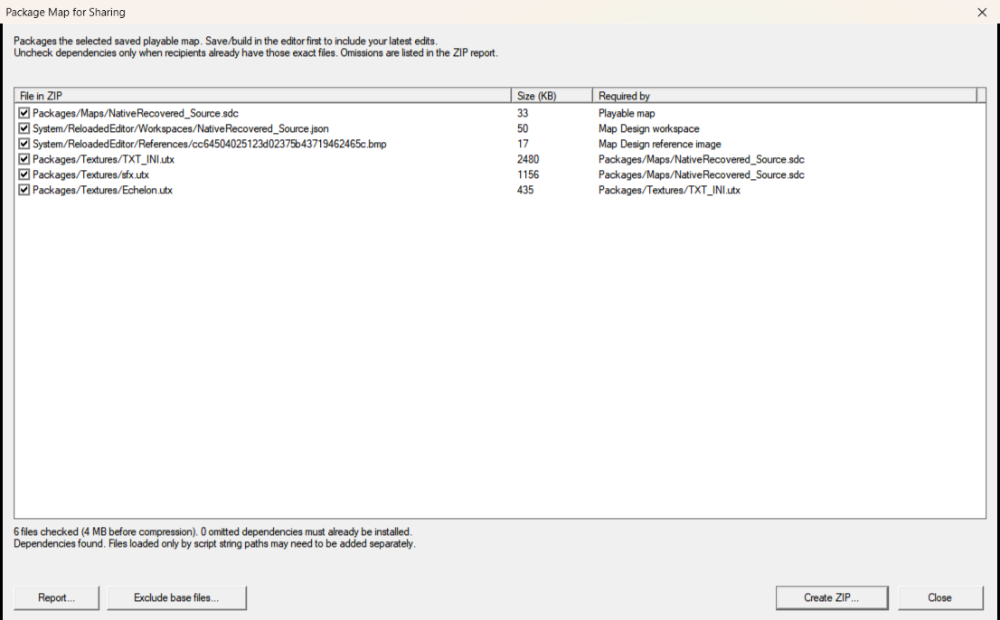

# RE+ (Reloaded Editor Plus)

RE+ is an unofficial patch for the **Splinter Cell: Chaos Theory Versus** map editor. It works with the stock game and with [Enhanced SCCT Versus](https://github.com/Joshhhuaaa/EnhancedSCCTVersus), and builds on [AllyPal's Reloaded Editor](https://github.com/AllyPal/SCCT_Versus_Reloaded_Editor).

## Install

1. Download the ZIP from [Releases](https://github.com/Lumbridge/SCCT_Versus_Reloaded_Editor/releases).
2. Extract it into the folder that contains `SCCT_Versus.exe`.
3. Run `Reloaded_Editor.exe`.

The editor keeps itself up to date: shortly after it starts, it checks the releases and offers a newer version in a window with its release notes and download size: **Install** (it takes effect the next time you start the editor), **Remind me later** (at the next start, tomorrow, in 3 days or in a week) or **Skip this version**. **Help > Check for RE+ Updates...** checks on demand, and **Help > Check for Updates at Startup** turns the automatic check off. After an update, the first start shows that release's notes once; **Help > What's New in RE+...** shows them again. The version an update replaced is kept as `Reloaded.Editor.previous.dll` (with `Reloaded_Editor.previous.exe` when the launcher changed): **Help > Roll Back to RE+ x.y.z...** puts it back at the next start, keeps the newer version to switch forward to again, and stops the startup check offering the version you left (**Check for RE+ Updates...** still can). The window title and **Help > About RE+...** show the version you are running.

### Versions

RE+ releases are numbered `MAJOR.MINOR.PATCH`, starting at **RE+ 2.0.0** (1.x was AllyPal's Reloaded Editor and the 1.3.0 betas that led to RE+):

- **MINOR** (2.1.0, 2.2.0) is a feature release: new tools, windows or workflows.
- **PATCH** (2.1.1) only fixes bugs.
- **MAJOR** changes only when something stops being compatible, such as the install layout or files an earlier version saved.

A release that needs testing first goes out as a release candidate (`2.1.0-rc.1`), marked as a pre-release on GitHub. The updater offers release candidates only to editors already running one, so everyone else gets the release.

Looking for maps to open? Recovered, enhanced and community maps are in [SCCT-Maps](https://github.com/Lumbridge/SCCT-Maps), and [SCCT Map Manager](https://github.com/Lumbridge/SCCT-Map-Manager) installs them for you.

## What it adds

### Map Design workspace



**RE+ Tools > Map Design...** is a floor-plan view for planning and greyboxing a map. Draw rooms, corridors, vents and doorways as parametric pieces and drag, resize or type to change them; the brushes in the map follow every edit in one Undo step. Right-click anywhere for what applies at that point. Copy, paste, duplicate and mirror pieces, pick common sizes from presets, draw sightlines that show where a wall blocks the view, or start from a **Versus starter layout** with spawn rooms, corridors, a vent route, starts, a mission and an objective already placed. It also has reference images, player-size guides, routes timed for spies and mercs, playtest spawns, groups and locks in a Scene panel, a design check, a **Security** window that places lasers, cameras, motion sensors, mines and alarms and wires them together, and lights placed from presets, dragged into reach, and checked for the dark spots spies will use. Full guide: [docs/MapDesign.md](docs/MapDesign.md).

### Gameplay tools



| Tool | What it does |
| --- | --- |
| **Gameplay Connections** | See every Tag/Event link in the map as a list or a graph, jump to connected actors, rename Tags together with the events that use them. |
| **SMagicEvent Workbench** | Edit event groups, triggers, actions and timing in one panel, with JSON export/import for sharing an event. See [the JSON format](tests/SMagicEventJson.md). |
| **SCamNetwork Manager** | Create, name, preview and reorder security cameras; links and first-camera flags are kept consistent. |
| **Objective creation** | Right-click an SMission or SObjective to add objectives, computer triggers, bomb targets or flag/drop-zone pairs, already linked. |
| **Zones** | In Map Design, list the match's zones: which objectives each holds, how many must be done, and what happens when it completes (doors open, lights switch, sounds play, a message on both HUDs, any actor triggered). One click gives each zone its own SMission, all of its objectives playable at once, under the map's chained top mission, in one Undo step, and reads them back for later edits. See [docs/MapDesign.md](docs/MapDesign.md#15-zones). |
| **Light and Shadow Map** | **RE+ Tools > Light and Shadow Map** colours the walkable BSP floor in every level viewport by how lit it is, to show where a spy can hide: **blue** hidden, **yellow** partly visible, **red** exposed (also told apart by the lines: a square, one diagonal, both), with a legend and, in the top view, a readout of the patch under the mouse. The 3D view hides patches behind walls; front and side views show the legend only. **Map Design > Tools > Show light and shadow map** draws the same patches on the plan. Brightness (0 to 255) is the brighter of the floor's baked lightmap and the in-game and dynamic lights reaching spy chest height, falling off to their reach and blocked by BSP. It is an estimate, not the game's own visibility formula: static meshes (as blockers or as floors), spotlight cones, projectors and flicker are ignored, so playtest to confirm. It follows edits a moment after they settle; toggle it off and on (or **Refresh** in **Light and Shadow Settings...**) after a lighting build. **Light and Shadow Settings...** sets the two thresholds, the patch size, the height lights are measured at and which brightness to use; they are kept in `Reloaded_Editor.ini` under `[LightShadowMap]`. |
| **Character Skins** | **RE+ Tools > Character Skins...** dresses the map's spies and mercs in its own materials or models, for example snow camo on a snowy map. **Download Default Skins...** saves the stock textures as 32-bit TGA files (SpyBody, SpyHead, MercBody, MercHead) to a folder you choose, to paint over in Photoshop or any paint program. **Import...** loads an edited image (TGA, BMP, PCX or DDS, sides a power of two) into the map's own package, compressed like the stock texture; **Use Selected** takes the Texture Browser's texture instead. An empty slot keeps the stock look. **Apply** compiles a small script actor into the map itself, so the game and the Reloaded patch are untouched; every machine that loads the map runs its own copy and nothing is sent over the network. Keep the layout of the downloaded textures so the UVs line up: thermal and EMF vision keep the stock heat and EMF masks, and the game's wet, sticky cam and phospho skins still show while they last. A 3D preview beside the fields shows a spy (left) and a merc (right) as they will look, holding a standing pose from their team's animations, and follows the fields as you edit them, before Apply: drag to turn, right-drag or the wheel to zoom, middle-drag to pan, double-click to reset. It does not show the goggle lights, and the map's own viewports still show the stock look; play the map to see the skins in game. **Spy model** and **Merc model** swap a team's whole character model for any loaded skeletal mesh (the stock spy and merc models are listed too); the team keeps its own animations, so moving, stances, the gun and gadgets still work, and a team with a model shows the model's own materials. **Goggle lights X Y Z** moves the spy's or merc's goggle lights along the head bone onto the new head (4, 0, 0 for the merc model on a spy, filled in when you pick it). When the map is played from the editor, the console (`` ` ``) has **addbot** to stand a character of the other team in front of you (a merc holds its gun), so you can see that team's look, and **killbots** to remove them; the console still prints "not a recognised command" after them. Maps made by earlier versions are updated on Apply. **Remove from Map** goes back to the stock characters. |
| **Character Skin Presets** | **RE+ Tools > Character Skin Presets...**, or **Presets...** in the Character Skins window, is a library of skins for one team each: a **spy preset** holds the spy body and head, the spy model swap and its goggle light offset, a **merc preset** the merc ones, so spies and mercs can wear different presets (desert spies against snow mercs). **Spy presets** and **Merc presets** at the top switch between the two lists; inside each, browse by category (Woodland & Jungle, Desert, Snow & Arctic, Urban & Night, Fun and your own) with search, small thumbnails and a large preview of that team's body and head. Below the preview, **On this map now** shows what both teams wear, with their textures and the preset's name. Every built-in look comes as a spy preset and a merc preset: Woodland, Jungle Tiger Stripe, Desert, Arid Digital, Snow, Arctic Digital, Urban Night, Midnight Blue, Team Red, Team Blue, Hazard Stripes, Solid Gold and Bubblegum. They are painted over the stock spy and merc textures when shown or applied, so folds, straps and the UV layout stay, lit lenses, lamps, skin and the merc's orange goggles are kept, and thermal and EMF vision still show the stock masks; nothing but the DLL is needed. **Apply to Spies on This Map** (or **Apply to Mercs**, or double-click) imports the preset's pictures into the map and applies it exactly as the Character Skins window's Import and Apply do, changing only that team: the other team keeps what the map gives it. Applying the same preset again reuses the textures it imported. **Save Current Spy Skins as Preset...** (or Merc, following the list shown) keeps that team's values from the Character Skins window as your own preset: textures stored in the map are saved as pictures beside it, other materials and models by name. **Rename...** and **Delete...** change your presets; built-in presets never change, **Hide** takes one out of the list and **Restore Hidden** brings them back. **Export Preset File...** writes a `.skinpreset` file of one preset with its pictures inside to share, and **Import Preset File...** adds one to your presets. Your presets live in `System\ReloadedEditor\skin_presets.json`, with their pictures in `System\ReloadedEditor\skin_presets\<id>`. Presets saved before presets were split by team, which dressed both teams, are split into a spy preset and a merc preset of the same name the first time the window opens (pictures included; the old file is kept as `skin_presets.before-teams.json`), and an older `.skinpreset` file imports as two presets. |
| **Map JSON import/export** | Export a map to JSON, edit it (or have something edit it for you), and import the changes in one Undo step. The import preview lists every actor added, modified (each property, old and new), moved and deleted; click a row to select the actor. Deleting actors needs an explicit opt-in in the change file. See [docs/MapAuthoring.md](docs/MapAuthoring.md). |

### Map recovery, lighting and sharing

| Tool | What it does |
| --- | --- |
| **Recover Compiled Map** (File menu) | Turns a compiled `.sdc` into an editable map with brushes, actors and extracted meshes. A progress window shows each stage; **Cancel** stops it until saving starts and leaves a new empty map with no files behind. At the end a **Recovery Report** gives brush and polygon counts before and after merging and lists what did not come back cleanly (thin brushes, actors left out, cleared references, meshes or BSP surfaces whose original lighting could not be kept); click a row to select and frame it. The original file is untouched. |
| **Merge Recovered Geometry** (File menu, on by default) | Recovery joins the compiled BSP's fragments into fewer, larger brushes (they may overlap, which leaves the built geometry the same) and combines matching surface pieces. Any merged brush the editor's BSP build does not reproduce exactly is split back automatically. Turn it off to get only the face joining earlier versions did. |
| **Recalculate Selected Lighting** (Build menu) | Re-bakes lighting only for the selected faces, brushes and meshes, keeping the recovered lighting everywhere else. |
| **Match Selected BSP Lighting** (Build menu) | Experimental: blends new BSP faces into the surrounding original lighting. |
| **Lighting Budget** (Build menu) | Lists every zone's lights (static, in-game, dynamic), the most in-game lights reaching one BSP leaf and the largest group of in-game lights that all overlap, measured the way the editor's own **Check InGame / Dynamic Lights** tools do, with the zones and hotspots over budget. Click a row to select its lights, double-click to frame them. Right-click a zone or hotspot (or use the buttons) to **Make Lights Static** (clears the in-game and dynamic flags so Build Lighting bakes them) or **Turn Off the Weakest** N; the window asks first and each fix is one undoable step. **Build All** and the lighting rebuilds warn first when a map is far over budget (**Build anyway / Open Lighting Budget / Cancel**, or don't warn again for that map this session). Limits are in `Reloaded_Editor.ini` under `[LightingBudget]`. |
| **Render Budget** (Build menu) | Per zone: static meshes and their triangles, actors, BSP nodes, surfaces and triangles, unique materials and textures, and emitters, with the zones and single meshes heavier than anything in the shipped Versus maps listed as hotspots. **What Renders From Camera** repaints the perspective viewport and shows the zones it sees through the portals, the actors the engine drew and the totals for that view. Click a row to select its actors, double-click to frame them. Guidelines are in `Reloaded_Editor.ini` under `[RenderBudget]`. |
| **Map Check** (Build menu) | Lists what the stock **Check Map for Errors** misses, from the BSP as last built: player starts, pickups and objectives in the void (solid space, outside every zone), far outside the geometry, beyond the world limit, or with their collision cut into BSP or a blocking static mesh (the editor's own spawn test); ZoneInfos in solid space or sharing a zone (two areas joined because a zone portal does not seal its opening, or an opening has no portal), with the leak path from one to the other drawn in the viewports like a pointfile; zones open to the outside of the map; and zone portals that seal nothing or left no polygons. The stock check's own entries are listed too, without its dialog. Click a row to select its actors or portal surfaces, double-click to frame them. Settings are in `Reloaded_Editor.ini` under `[MapCheck]`. |
| **Package Map for Sharing** (File menu) | Builds a ZIP of the map with all its dependencies and an install readme. |
| **Optimise Map Assets** (File menu) | A map that uses a few meshes or textures from a big pack (a CoD4 or GoldenEye port, say) needs the whole pack shipped with it. This lists every package the map takes assets from, with how many it uses, their size and the whole package's size, and ticks the ones it uses less than half of. **Create Release Copy** saves the map, then writes a copy under a new name (MapsEd and the playable Maps copy) that carries just the assets it uses from the ticked packages, either inside the copy itself (one file to share) or in a package of their own (`<Map>_Assets.usx`, for several maps that share props). Assets keep their pack and group as groups (`MyLevel.COD4_bog.Props.Crate`). The copy's own import table is checked afterwards, and anything it still takes from a ticked package is moved too, so the copy needs none of them. Your working map keeps using the packages, and the packages are not changed. **Show Assets...** lists every asset with its size, and what the map already carries. Share the release copy with Package Map for Sharing. Assets a script loads only by name are not found. |

Recovered maps keep their original baked lighting through ordinary builds. Recovery is experimental: brush history cannot be restored, so check the result in the editor and in game.

### Everyday editing

| Tool | What it does |
| --- | --- |
| **Open Recent** | **File > Open Recent** lists the last ten maps opened or saved, and warns before discarding unsaved changes. (The editor's own autosave, in Advanced Options, still writes `Auto0` to `Auto9.sdc` into MapsEd every five minutes.) |
| **Crash recovery** | If the editor crashed, stopped responding and was ended, or was killed, the next start offers to open the newest autosave written during that session, or the map as it was last saved, and names the session's crash report in `System\Diagnostics` if one was written. Autosaves from before that session are never offered. Other editors still running are not mistaken for a crash. **File > Open Latest Autosave...** opens the newest `Auto*.sdc` at any time. An autosave opens under its own name: use **Save As** to keep it. Set `OfferAtStartup=0` under `[CrashRecovery]` in `Reloaded_Editor.ini` to turn the offer off. |
| **Play From Camera** | **Build > Play From Camera as Spy / Merc** starts a playtest at the perspective viewport's camera, from that team's start or a temporary one that is removed afterwards. |
| **Level Snapshot** | **Build > Set Level Snapshot from Viewport** captures the perspective viewport as the picture the game shows in map selection; **from Image File...** takes a PNG, JPG or BMP instead. Either goes into the map's `<Map>-i` package next to its loading screens and map settings, with the previous package backed up under `System\ReloadedEditor\snapshot-backups`. |
| **Generate Minimap** | **Build > Generate Minimap...** draws a clean top-down plan of the map from its built geometry, in the stock style (the floor shown in light green, every other floor dark, transparent around the map), with objectives numbered by objective, flags, drop zones, spawns and static meshes as options. **Floors at Z** lists the floors (the map's in-game floors if it has them, else the storeys found in it; type your own and **Apply**); **Show** picks the whole map or one floor, and **Heights** any height range. **Set as the in-game map** makes one 256 x 256 picture per floor in the map's own package (`MyLevel.Minimap.Floor0`, ...) and points the LevelInfo's `MapFloors` and `SnapshotCamera` at them, in one Undo step: in game, the map page shows the floor the player stands on and places the players on it. Save the map to keep it. **Write Briefing to the interface package** puts the picture in the map's `<Map>-i` package as the plan the lobby shows (backed up first, like Level Snapshot). **Save Image...** saves a PNG or TGA at 256, 512 or 1024. **Framing** keeps the play area (spawns and objectives) in view, takes everything built, or keeps the map's current minimap camera. |
| **Select and hide** | Right-click an actor for **RE+: Select** (all of this class, all with this Tag, same static mesh, invert the selection) and **RE+: Visibility** (hide selected, isolate selected, unhide all); Brush Visibility has the same three buttons. |
| **Brush Visibility** | Show, hide, isolate or select zones, portals, volumes, brushes and movers from one panel. What is hidden stays hidden through a geometry build, which the stock editor makes visible again. |
| **Storeys** | The Map Design plan's floor slider, for the editor's own viewports: pick a storey and everything standing on the other floors is hidden, so a multi-level map is worked on one floor at a time. **Page Up / Page Down / Home** over a viewport step through them while the palette is open. Surfaces already built into the BSP stay, so it reads best in the wireframe views. |
| **Working Views** | Save and restore viewport cameras and display settings. Each view shows a thumbnail of the perspective viewport taken when it was saved or updated; right-click a view for **Update Thumbnail**. Thumbnails live in `System\ReloadedEditor\thumbnails`, named after the view's id, so renaming keeps them and deleting removes them. Views saved before thumbnails existed show a placeholder until updated. |
| **Actor Assemblies** | Save groups of actors and brushes and reuse them across maps. Each assembly shows a thumbnail taken when it is saved, with the perspective camera briefly moved to frame the selection and then put back exactly; right-click for **Update Thumbnail**, which frames the current selection (or takes the viewport as it is when nothing is selected). |
| **Emitter Library** | **RE+ Tools > Emitter Library...** browses particle effects by category with search and a live, engine-rendered preview (drag to orbit, wheel to zoom). **Place at builder brush** (or double-click) adds the effect in one Undo step. Tick **Loop** to place any effect, triggered ones included, so it plays again on its own a random wait of your chosen seconds after it ends. Ships with 37 effects captured from the stock maps: fire with smoke, torches, steam, drips, splashes, bubbles, rain, snow, sparks, dust, moths and triggered bursts. Select emitters and right-click **Save to Emitter Library...** to add your own; read-only effect packs in `System\ReloadedEditor\EmitterPacks` appear as their own group. **Edit effect...** opens an edit panel for each particle system of the selected effect: particle count, rate and initial rate, lifetime, size and height, velocity, acceleration, texture (typed, or **Use texture browser selection**), a tint and its colours over life (colour picker). Each change shows in the preview at once, and values are checked (ordered ranges, capped counts and rates). **Revert** restores the effect's values, **Save as New Effect...** keeps a copy under Your effects and **Save** updates one of your own; built-in and pack effects never change, and **Place** puts the edited version in the map. |
| **Undo History** | **Edit > Undo History...** lists every step in the editor's undo buffer, oldest at the top, with the steps waiting for Redo greyed below the current one, and how much of the buffer's memory they use. Double-click a step to undo or redo, one stock step at a time, until the map is as it was after it; the list follows every edit, map load and buffer reset. **Add checkpoint...** (or **Edit > Add Undo Checkpoint...**) names the current step, such as "before vent rework"; right-click a step to name it instead, rename or remove a checkpoint (Delete also removes). Checkpoints show as tags in the list, and the jump list above it undoes or redoes straight to one. A checkpoint lasts while its step is in the undo buffer: it goes when the full buffer drops the step, when a new edit replaces the undone steps it was on, or when a map load clears the history. |
| **Animation Browser** | **View > Show Animation Browser** browses skeletal meshes, animation sets, sequences and notifies, and imports `.psk`/`.psa` files. Importing a `.psa` into an existing set honours the import options: **Merge sequences into existing** adds the file's new sequences and keeps the rest (the skeleton must match bone for bone, or nothing changes), **Overwrite existing sequences** also replaces same-named ones, and **Keep Notifies** carries a replaced sequence's notifies onto its new version. Without Merge the file replaces the whole set, after a confirmation. The set stays the same object, so meshes using it stay linked; nothing is undoable, so save once you are happy. Standard ActorX `.psa` files import too (the stock editor crashed on them). |
| **Find Usages** | Find where a texture or mesh is used in the open map, and replace it. **Find Usages in All Maps...** (right-click a texture or static mesh in its browser, or **Search All Maps...** in the Find Usages window) lists every map in MapsEd that uses it, optionally the game's Maps folder too, before you change a shared package. Maps are read from disk, not opened: each row counts the actor properties and brush faces that refer to the object (a brush face count can exceed the built BSP surfaces), and a package or group name finds everything in it. Open a map from the list, with the usual unsaved-changes prompt, or copy the results. Objects stored inside a map's own package are not found this way. |
| **Favorites** | Keep frequently used materials and meshes together. In the Static Mesh Browser, **Favorites** lists your favourite meshes from every package, whichever map is open (their packages load as needed); filter it to one package and sort by package, name, or when you added them. Favourites that cannot be loaded, such as meshes stored inside a map, stay listed as *not loaded* and can still be removed. The Texture Browser's **Favorites** tab works the same way: thumbnails of your favourite materials from every package, with a package filter and the same sort orders above them, and any that cannot be loaded listed below them, where right-click removes them. |
| **Favorites tab** | A **Favorites** tab in the browser window, next to Textures, Static Meshes, Sounds and the rest (**View > Favorites...**, or **All Favorites...** in any browser's Favorites view or right-click menu, also goes there), lists your favourite materials, static meshes and sounds together, with thumbnails of textures, a type, package and tag filter, a search (names, packages and tags) and the browsers' sort orders. **Use** (or double-click) makes a material or mesh the current one, to apply or place as from its browser; **Show in Browser** opens its browser on Favorites with it selected; **Play** (or double-click) plays a sound. Tags group favourites ("Ship interior", "Lights") and a favourite can have several: type a name under the tag list and press **New**, then add favourites with **Add to Tag...**, right-click, or by dragging them onto a tag; pick a tag to see only its favourites, or **Rename**/**Delete** it. Favourites that cannot be loaded stay listed as *not loaded*. The lists are the browsers' own, so their Favorites views stay in step; tags are kept in `[FavoriteTags]` in `Reloaded_Editor.ini`, one key per tag and per tagged favourite, and every change starts from what is saved, so two open editors keep each other's. If the browser window has been closed, or every browser floats on its own, the same list opens as a floating window instead. |
| **Property filter and multi-edit** | Actor Properties (F4) and Level Properties (F6) get a **Filter** box: type part of a property or category name (several words narrow it, `events tag`) and only matching properties stay listed, their categories opened; **Esc** clears it and restores the categories that were open. With several actors selected, even of different classes, the window edits the properties they share; a value typed once goes to all of them, rows where they differ read *(multiple values)*, and **Undo** now takes a property edit back, from every selected actor in one step (the stock window recorded nothing to undo). |
| **English for French names** | Many stock assets have French names (Porte, Mur, Beton, Tuyau, Plafond and short forms such as FoPlaf or Tuyo). Without renaming anything, the browsers show the English next to them, as in *Porte_Metal01 (door metal 01)*: the Texture Browser's labels and caption, the Static Mesh, Sound and Animation browsers' lists and package/group boxes, and the Actor Class tree; hover a list too narrow to show it for the whole name. The Texture Browser's **Filter** box finds either language, so *door* finds Porte_01 and *porte* still does. Turn it off with **Show English for French asset names** in RE+ Options. Add or correct words in `System\ReloadedEditor\Translations\fr-en.txt` (created on first start; your entries win). |
| **Sound Browser search and Favorites** | Type in the Sound Browser's **Search** box to filter the list as you type (every word must appear somewhere in *package.group.name*, case ignored). With **All packages** ticked the search covers every loaded sound package and each row shows its package; untick it to filter only the package shown. **Add Favorite** (or right-click **Add to Favorites**) keeps the selected sound; **Favorites** then lists them from every package, loading their packages as needed, with a package filter and sorting by package, name or when added. Play, Properties, Copy Shortcut and a property's **Use** work on these rows as on normal ones. Favourites that cannot be loaded stay listed as *not loaded* and can still be removed; they are kept in `Reloaded_Editor.ini` and merged with the saved list on every change, so two open editors keep each other's. |
| **BSP texture copy/paste** | Copy a surface's material without disturbing the target's alignment. |
| **Select Brush** | Select the source brush from a BSP surface. |
| **Grid snapping** | Right-click a brush face or vertices to snap them to the grid per axis; **Ctrl + mouse wheel** changes the grid size. |
| **Measure** | Right-click any viewport, 2D or 3D, for **Measure > Start Here** and **To Here** (snapped to the grid when it is on, like **Builder Brush > Place Here**; **Clear Measurement** removes it). Every viewport draws the line with its X/Y/Z legs and reads out the distance in units and player heights (180 units, Map Design's standing height), dX/dY/dZ, the horizontal run and Map Design's spy/merc run time. In a 2D view the axis it looks along is taken from the other end, or left out when both ends are in that view. **M** over a viewport measures on from the last end to the mouse: in a 2D view the point under it, in the 3D view where the mouse meets the floor at the last end's height. |
| **Placement** | Right-click an actor for **RE+: Placement** (also **RE+ Tools > Placement**). **Drop to Floor** (**End** over a viewport) rests each selected actor's bounding box on the surface below it: a mesh by its bounds, a pawn, pickup or light by its collision cylinder; **Shift+End** also turns meshes to sit flat on a slope, **Ctrl+End** drops to the ceiling, and **Push to the Wall Ahead** moves along the way the actor faces. **Align to Last Selected** lines the others up with the last actor you selected by the minimum, centre or maximum of their boxes on X, Y or Z; **Distribute Evenly** spaces three or more along an axis or on the line between the first and last selected. **Copies in a Line / Round a Centre / Along a Path** open a small window with a live preview in the viewports: a count and offset; a count round the builder brush, the last-selected actor or a typed point (on the selection's own circle or at a radius, over a full turn or an arc, turning with the circle or not); or copies to an end point by count or one every so many units, for railings, pillars and lights down a corridor. Copies keep their Tags and properties (a Tag that an Event inside the selection names gets a fresh one per copy, so a copied switch works its own door). Every operation is one Undo step; locked actors stay put and CSG brushes are not dropped. |
| **Fit builder brush** | Right-click selected meshes or brushes to enclose them in the builder brush, including rotated brushes. |
| **Smooth Staircase** | Select a staircase brush (made with the linear, curved or spiral stair builder, or Map Design stairs, which are a brush per step) and right-click it, or one of its faces, for **Smooth Staircase**. It lays an invisible BlockingVolume over the step edges, starting at the floor a step in front of the first one, so players walk up and down it as a ramp instead of bumping over each step: a straight flight gets one flat slab, a spiral or curved one a single winding slab with no seams. Shots and traces still hit the visible steps. Landings stay flat. Smoothing a brush again replaces its ramp, and **Remove Staircase Smoothing** deletes it; the ramps are named `StairRamp_<brush>_...`, sit in the **StairRamps** group, and each change is one Undo step. |
| **Quick portal** | In Vertex Editing, select four coplanar corners and right-click **Add portal sheet**. Creates a single invisible, non-solid zone portal polygon whose corners are the selected corners, like the stock Add Special zone portal on a sheet brush, with Undo/Redo. |
| **Self-updater** | Offers newer releases at start-up, showing the release notes and download size with Install, Remind me later and Skip this version, and installs them in place; **Help > Check for RE+ Updates...** checks on demand. The first start of a new version shows its release notes once (**Help > What's New in RE+...** on demand), and **Help > Roll Back to RE+ x.y.z...** swaps back to the version the update replaced, keeping the newer one to roll forward again. |
| **RE+ Shortcuts** | **Help > RE+ Shortcuts...** lists every key, mouse gesture and menu the patch adds, with the Geometric Event keys as configured. |
| **Fixes** | Playtests launch at the monitor's resolution, off-screen property windows come back, a missing builder brush is repaired, larger BSP point counts are supported, and crashes are logged. |

AllyPal's original fixes are included: faster selection, restored Echelon lighting, improved lightmaps and larger WAV imports.

<details>
<summary>More screenshots</summary>







</details>

<details>
<summary>Build from source</summary>

Use a Visual Studio C++ developer PowerShell with the v143 toolset and the manifest's vcpkg dependencies installed:

```powershell
$env:SCCT = $null # Skip deployment into an installed game.
msbuild SCCT_Versus_Reloaded_Editor.sln /m /t:Rebuild /p:Configuration=Release /p:Platform=x86 /p:PlatformToolset=v143
if ($LASTEXITCODE -ne 0) { throw 'Release build failed' }
./tools/package_release.ps1
```

Set the version in `Reloaded.Editor/Version.h` first: the title, About box, updater, DLL properties and archive name all come from it. The release ZIP is written to `bin/Reloaded_Editor_Plus_v<version>.zip`; tag the release `v<version>`. Packaging downloads the unchanged AllyPal v1.2 launcher and verifies its hash; pass `-LauncherPath` to use a local copy. Tests are described in [tests/README.md](tests/README.md).

</details>
