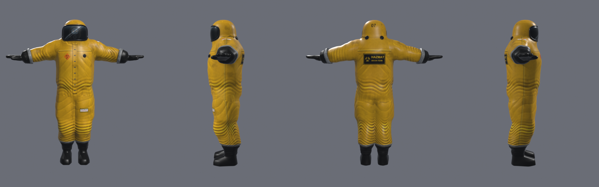

# Hazmat suit for the merc

A yellow Level A encapsulating suit for the Versus merc, built in Blender: a baggy rubber suit whose
hood runs straight into the shoulders, a wide face window with a rubber gasket (the wearer's breathing
mask shows dimly behind it), exhaust valves on the hood and chest, a press-stud zip flap, taped seams,
black gloves with fingers and grey tape over the cuffs, black boots with the legs taped over them,
labels, and grime rising from the boots. Folds bunch at the elbows, knees, waist and hems.

It uses the stock merc skeleton (all 42 `DEF_01` bones), so the merc's own animations (`SPerso.Def`)
drive it with no changes, including the gun on `B R Hand`.



`assets/` holds the finished model, ready to import:

| File | What it is |
|---|---|
| `HazmatMerc.psk` | the mesh: 5187 points, 10254 triangles, 2 materials (`HazmatSuit`, `HazmatGear`) |
| `HazmatSuit.tga` | 1024x1024 suit, glove and boot texture (folds, AO and labels painted in) |
| `HazmatGear.tga` | 512x512 visor, gasket and valve texture |
| `hazmat.json` | counts, the mesh rotation and the goggle light offset |
| `preview_*.png`, `pose_*.png` | Blender renders (as the game shows it), and software renders posed by merc animations |

## Put it on ShipD (or any map)

The model goes into the map itself (MyLevel), so the map works for everyone without an extra package.

1. Open the map in the editor (from `Packages\MapsEd`).
2. **Texture Browser > File > Import**: import `HazmatSuit.tga` and `HazmatGear.tga` with
   Package `MyLevel`, Group `Hazmat`, and the names left as `HazmatSuit` and `HazmatGear`.
   Compress both as DXT1 if you like (right-click > Compress); it is not required.
3. **View > Show Animation Browser > File > Import Mesh**: pick `HazmatMerc.psk`, Package `MyLevel`,
   Name `HazmatMerc`. The editor log should say `Found texture for material 0: [HazmatSuit]` and
   `material 1: [HazmatGear]`; that links the textures. Import the textures first, or the mesh is untextured.
4. Still in the Animation Browser, on the **Mesh** tab, set **Rotation** Yaw to **-16384** (the stock
   merc's value; without it the suit lies on its side).
5. **RE+ Tools > Character Skins**: in **Merc model** type or pick `MyLevel.HazmatMerc`; the merc's
   goggle lights fill in as **X -0.1, Y -2.8, Z -0.8** (they then sit on the visor). Press **Apply**.
6. Save the map. Play it (Play Level as a spy, then type `addbot` in the console to see a merc in it).

A map that already has the older procedural suit: import the new textures and mesh over the old ones
(same names), set the Yaw again, and re-apply Character Skins so the goggle lights move to the new visor.

## Rebuild it

Needs Blender 5.2 (it is driven from the command line; the scripts default to
`C:\Program Files\Blender Foundation\Blender 5.2\blender.exe`) and Python 3.10+ with numpy, scipy,
Pillow and scikit-image (`python -m pip install --user numpy scipy pillow scikit-image`).

```
sh blender/run_all.sh "C:\path\to\SVM 4.0 Public Beta Mapping Ver"
```

That writes `out/blender/assets/` (copy what you want into `assets/`) and `out/blender/hazmat.blend`,
which you can open: the textured game mesh under an "Unreal view (Y mirrored)" empty, and the
high-poly parts it was baked from, hidden. The four stages:

1. `blender/prep.py` (Python): reads the stock merc (`merc_mesh.py` parses `SPerso.ukx`) and builds
   watertight high-resolution parts as blurred distance fields around its skin: the suit (per-bone
   stand-off in `STANDOFF`, the hood and the breathing-set hump, cut at the wrists and above the boots),
   each glove (tight on the fingers, a flared gauntlet over the sleeve) and each boot.
2. `blender/build.py` (Blender): folds, seams, zip flap, tape and sole lip as displacements on the
   high-poly parts (`displacement`, `detail_*`); the visor, gasket and valves; decimated game meshes
   (`TRIANGLES`), Smart UV Project; Cycles bakes of normals, AO, positions, regions and masks.
3. `blender/finish.py` (Python): paints the textures from the bakes (`paint_suit`, `visor_art`, the
   labels from `build_hazmat.py`), copies bone weights from the merc's skin (the suit from the whole
   body, gloves from the hands and forearms, boots from the feet and calves; the hood and its gear rigid
   on `B Head`) and writes the PSK in the merc's winding.
4. `blender/render.py` (Blender): textures the game mesh, renders the previews, saves the `.blend`.

`pose_preview.py --install ... --out out/blender/assets --merc` poses the result with `SPerso.Def`
sequences to check the rigging; `blender/look.py` renders quick Workbench views of `parts.npz` or a `.blend`.

The meshes keep the merc's own coordinates. Unreal is left-handed, so seen directly in Blender they are
a mirror image of the game; the previews and the saved scene mirror them back. Labels are placed for
the game: text that reads correctly in the previews reads correctly in game.

`build_hazmat.py` is the earlier procedural build (no modelling program); the Blender build reuses its
skin sampling, label art and PSK writer.

## Known limits

- The suit is bulkier than the merc, so some poses clip a little (forearms into the chest when reloading,
  the inside of the thighs when crouching).
- The visor is opaque: the mask behind it is painted, not seen through.
- Thermal vision shows the whole suit evenly hot (the stock heat masks fit only the stock texture layout).
- Put on a spy (Spy model), it follows spy animations, but the camera and proportions were not made for it.
